# Muse Office

## Give your Muse a chief of staff hat

Keep talking to the Muse you already know. With this hat, it organizes work,
keeps a team of agents and their instructions current, checks results, and
brings decisions back to you. Their work stays visible in a private **Office**
that your Muse builds for you. The sample team is a starting point: you can
ask Muse to add, change, or remove agents as your work changes.

### [Copy the message →](https://tinyhat.ai/muse)

Paste it into your chat with Muse. Muse shows you its plan and waits for your
approval before setting up the team and Office. You can edit the message
before you send it. [Read the stable message first](https://github.com/tinyhat-ai/muse-office/blob/channels/lts/hat/PROMPT.md).

**What changes:**

- **A way to organize work.** Muse turns substantial requests into owned tasks,
  gives agents focused briefings, checks their results, and records decisions.
  Each agent has its own face, instructions, skills, and memory. Ask Muse to
  create, change, or retire an agent; the initial roles are examples.
- **A place to see the work.** Projects shows the tasks and what is waiting on
  you. Team shows who does what. Customers keeps track of people. Reports
  shows visual charts. Notes keeps decisions and useful knowledge. You can
  comment on a task or note; Muse checks comments on a schedule and routes
  each one to its owner for follow-up.
- **Your approval still matters.** Muse asks before anything is sent, bought,
  published, or deleted. The Office starts with real setup work and clearly
  labeled public example charts; it does not invent customers or business
  results for you.

The hat is a set of instructions, not an app you need to install by hand. This
repository also contains the Office reference app and the files Muse uses to
build your copy. [See the landing page](https://tinyhat.ai/muse) for the team
and the before/after view.

## See an Office made by Muse

These are pages from an Office a Muse built from the promotion message. The
current reference app adds tagged notes and a more useful first visit.

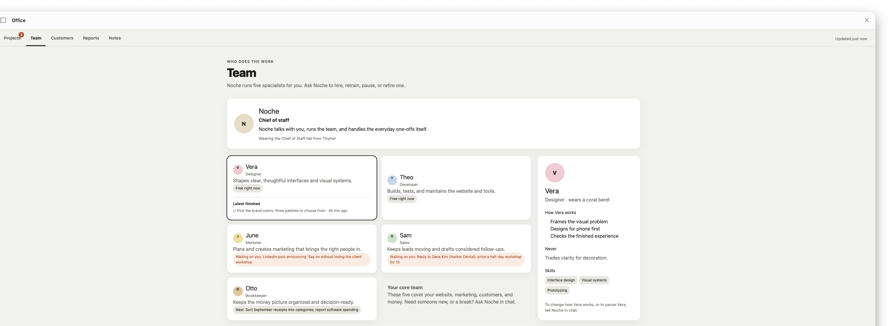

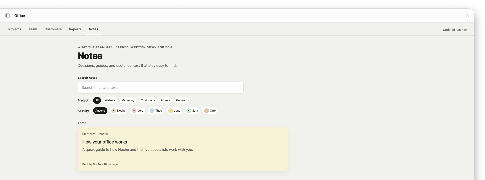

## For developers: run the reference Office locally

```bash
npm install
npm run dev
```

`npm test` runs the small test suite (the Markdown sanitizer and the question/answer loop) with Node's built-in runner.

Open <http://localhost:3007>. The first start creates `data/office.db` and
fills it with a starter Office: real setup tasks, an initial team, a guide in
Notes, two contacts outside the customer funnel, and four cited public charts.
It does not invent business results or customers. `npm run reset` deletes the
data; the next start seeds the starter again. Use `OFFICE_SEED=demo npm run dev`
for the fictional consultant showcase shown in some screenshots, or
`OFFICE_SEED=none npm run dev` for an empty database.

The pages are mostly for reading. You can comment on tasks and notes, and reply
to a task update. Everything else changes through Muse and the Office actions.

## First visit

The starter board shows setup work and one real question for the person. Team
members have distinct illustrated faces. Customers contains orientation contacts
outside the sales funnel; the funnel stays at zero until real people are added.
Reports opens with four charts from linked public sources, and Notes renders a
Markdown table and a Mermaid flowchart.

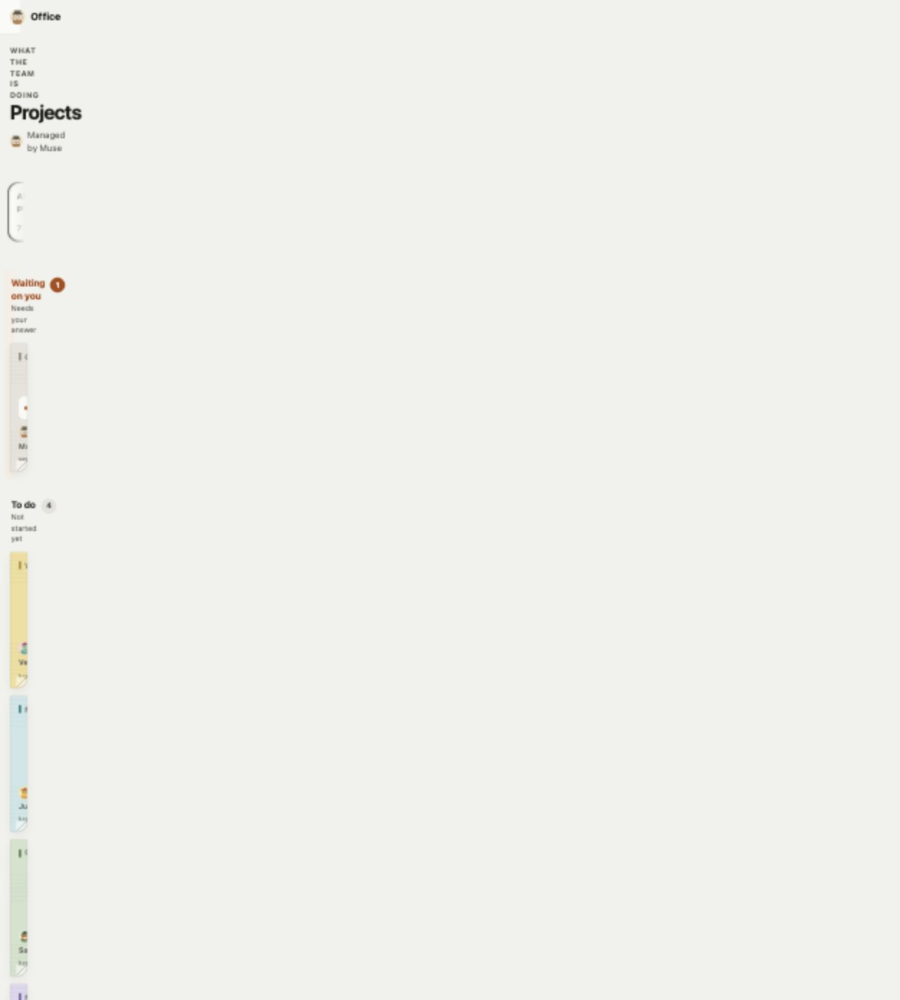

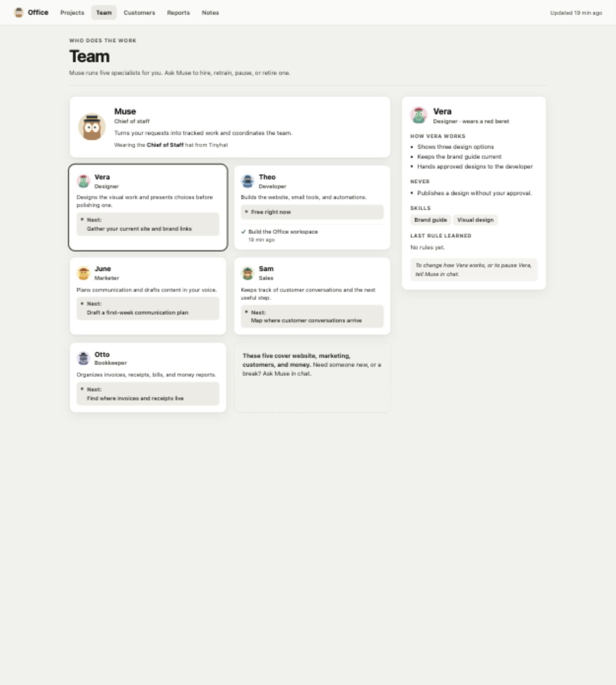

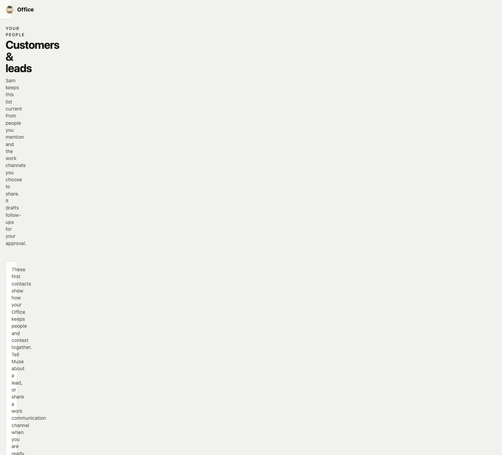

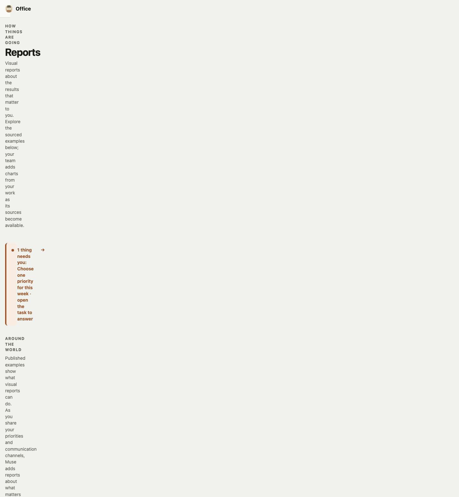

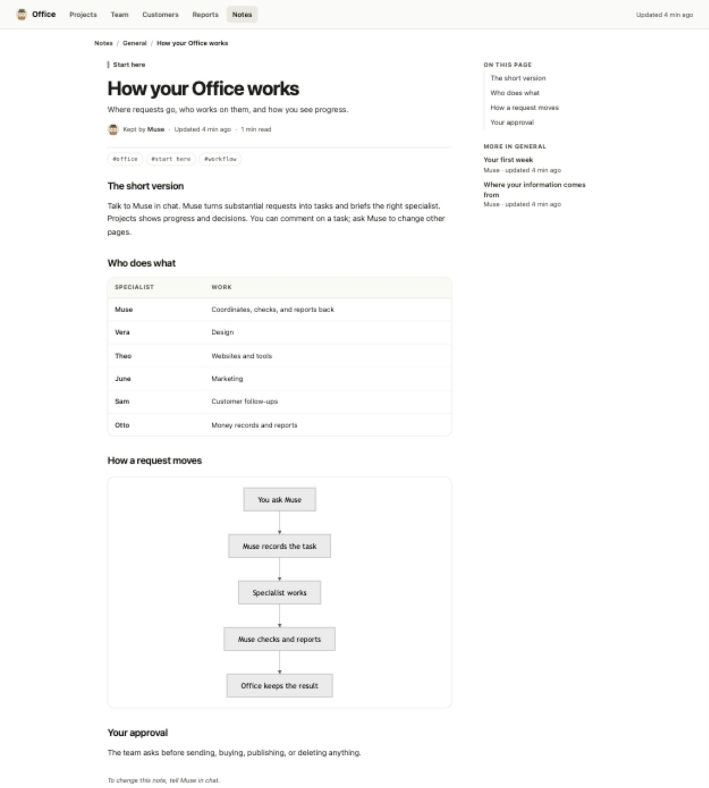

## What it looks like

The board: lanes with a coloured rule, sticky notes in the project's colour, and a "Waiting on you" lane for the things only the person can answer.

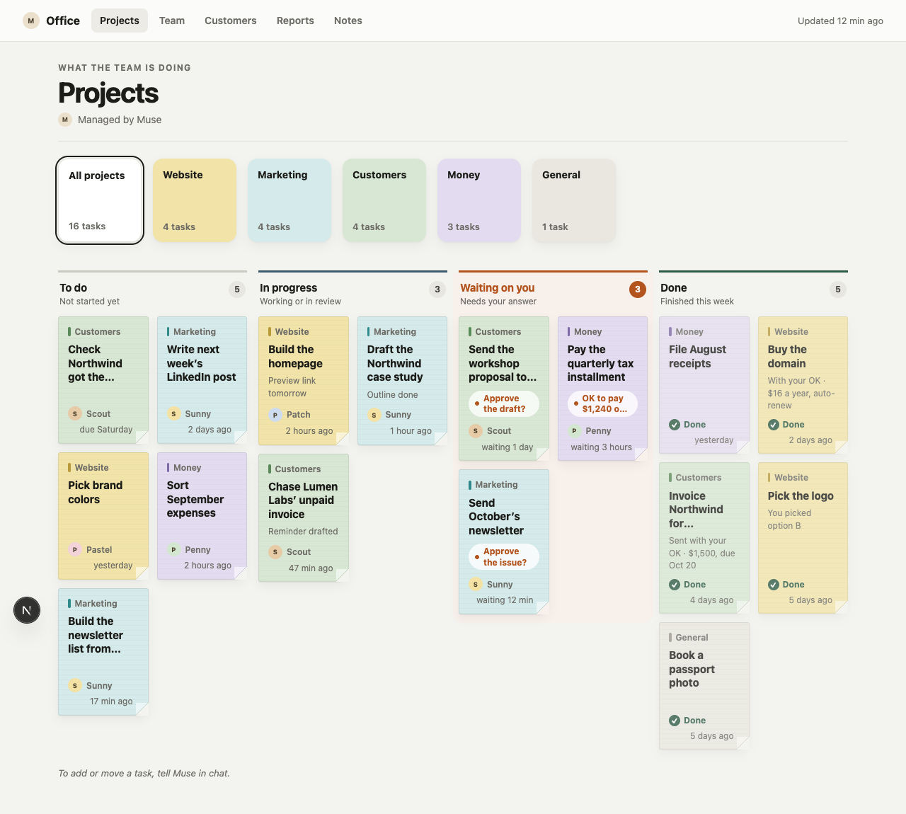

A task's page, the one place the person can write: the pinned question with a one-tap answer, what the task is, done-when, the plan, and the conversation.

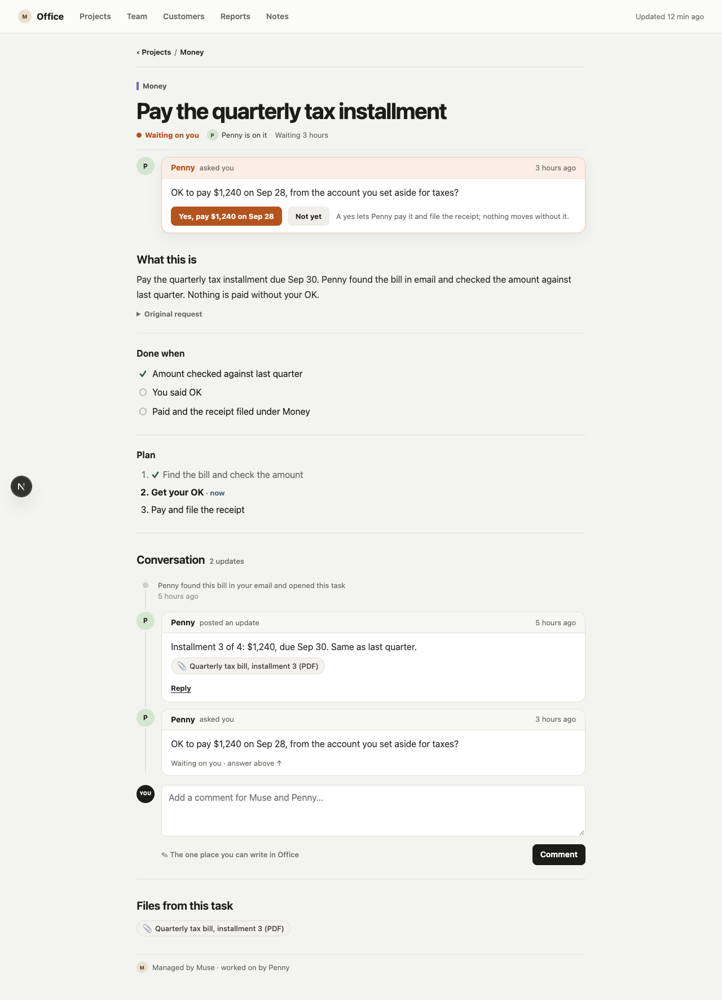

Customers (a small funnel, this week's follow-ups, the people table; the person and the hat's maker kept as contacts outside the funnel) and Reports (results, not activity):

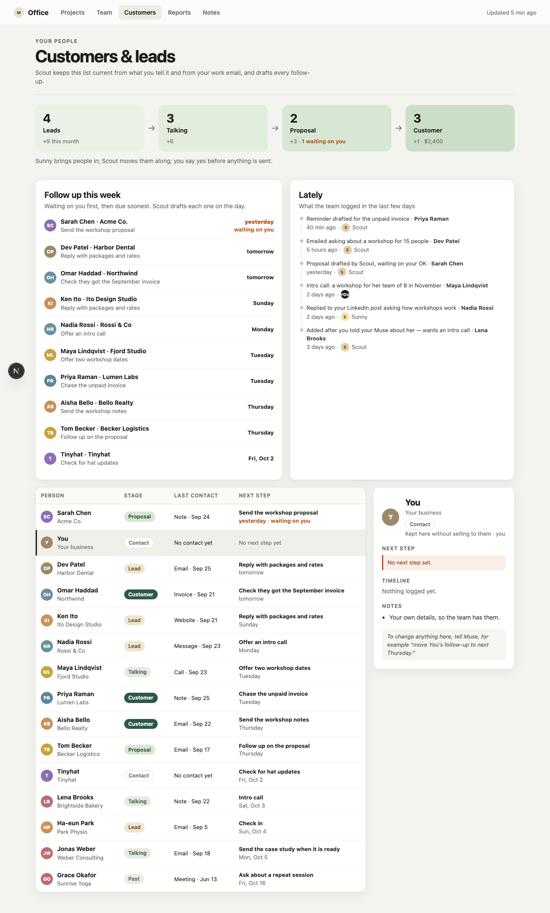

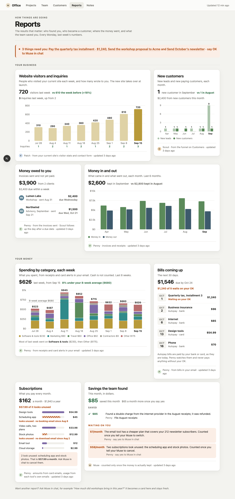

Notes carry tags for finding them later, and a note can hold a small visual (here, how a change goes live), which scales down on a phone:

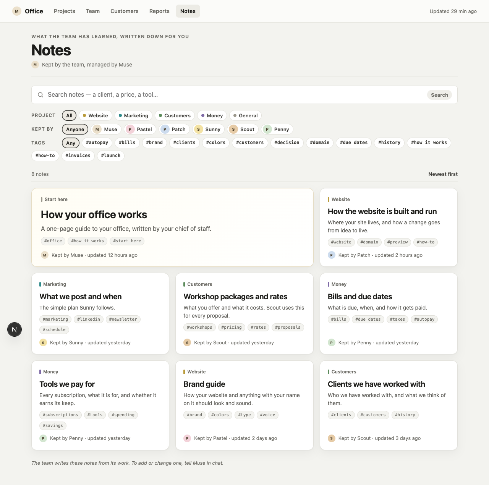

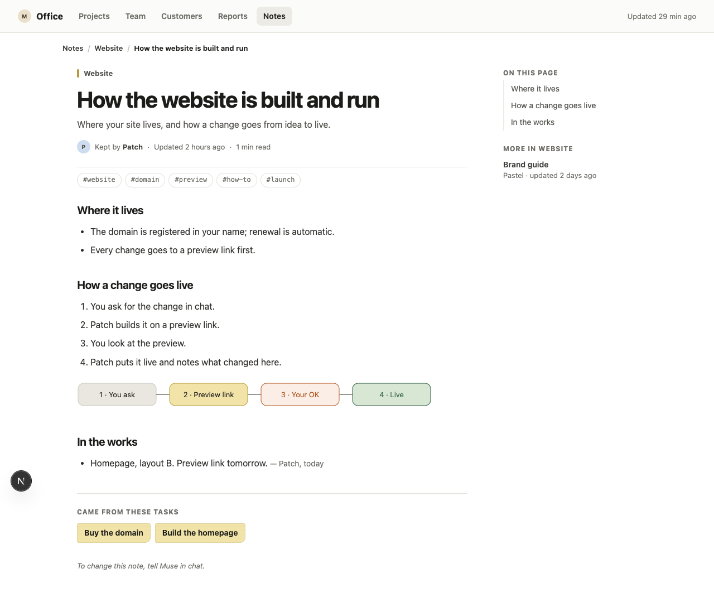

More in [`docs/screenshots/`](docs/screenshots/): a project's page, Team, the board and a note on a phone, and a task whose money question was asked again with a new amount (the earlier yes stays with the earlier question).

## The actions

```bash
curl -s localhost:3007/api/actions | jq .            # the catalog
curl -s -X POST localhost:3007/api/actions/create_task \
  -H 'content-type: application/json' \
  -d '{"project":"website","title":"Pick brand colors","specialist":"pastel"}'
```

Every action is `POST /api/actions/<name>` with a JSON body and answers
`{"ok":true,"data":…}` or `{"ok":false,"error":"…"}`. The full contract is
in [`spec/ACTIONS.md`](spec/ACTIONS.md).

## What is where

| Path | What |
| --- | --- |
| `hat/HAT.md` | The entry instruction. tinyhat.ai serves this file. |
| `hat/SOUL.md` | How the chief of staff behaves every day. |
| `hat/skills/` | Setup, running a task, improving a process, the avatar. |
| `hat/team/` | Five optional starter specialist briefings; Muse can change the team. |
| `hat/processes/` | Five ways a project can run. |
| `hat/apps/office.json` | The build request for the Office app. |
| `spec/PAGES.md` | What every page shows. |
| `spec/DESIGN.md` | Tokens, colours, the sticky-note board. |
| `spec/SCHEMA.md`, `db/schema.sql` | The database. |
| `spec/ACTIONS.md` | The actions. |
| `src/` | The reference app (Next.js app router, `better-sqlite3`). |

## Versioning

`VERSION` and the `version:` line in `hat/HAT.md` move together; see
[`RELEASING.md`](RELEASING.md) and [`CHANGELOG.md`](CHANGELOG.md).

[`channels/lts`](https://github.com/tinyhat-ai/muse-office/tree/channels/lts)
carries the stable promotion message. [`channels/latest`](https://github.com/tinyhat-ai/muse-office/tree/channels/latest)
tracks the newest published release. `main` is for upcoming changes and may
move ahead of both channels. The message currently links Muse to build
materials on `main`, so those files can change independently of the LTS
message. See the [first release](https://github.com/tinyhat-ai/muse-office/releases/tag/v0.0.1).

## License

MIT, see [`LICENSE`](LICENSE).
