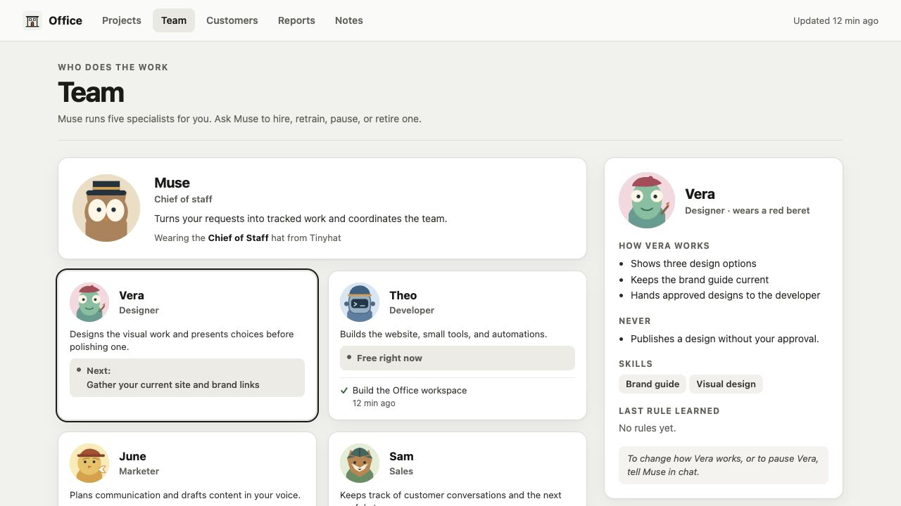

# Muse Office

## Promote your Muse to Chief of Staff

Instead of trying to do every job in one chat, Muse becomes your chief of
staff. You still talk to Muse; **it manages a team of specialist agents**,
checks their work, and keeps you informed. What you teach a specialist becomes
part of that agent's own skills and memory, so each one gets better at its job.
Follow the team's progress and decisions in one private Office. Nothing is sent,
bought, published, or deleted without your OK.

### Give Muse the hat

1. [Open the message to send Muse →](https://github.com/tinyhat-ai/muse-office/blob/channels/lts/hat/PROMPT.md)
2. Copy the text between the two horizontal lines and paste it into your Muse chat.
3. Review Muse's plan and approve it when you're ready.

The hat is simply a message you send Muse. There is no app to install yourself.
You can change the message before sending it. The team starts with examples;
ask Muse to add, change, or remove specialists as your work changes.

### See the work

Ask Muse to help launch a workshop. It can give the page, announcement, and
follow-up to the right specialists. Your Office shows who owns each part, what
needs your decision, and the notes and reports worth keeping. You can comment
on a task or note; Muse follows up with its owner.

This open source repository has the message and the Office Muse builds. See the
[developer guide](docs/DEVELOPING.md) if you want to explore the code. The
project is [MIT licensed](LICENSE).
