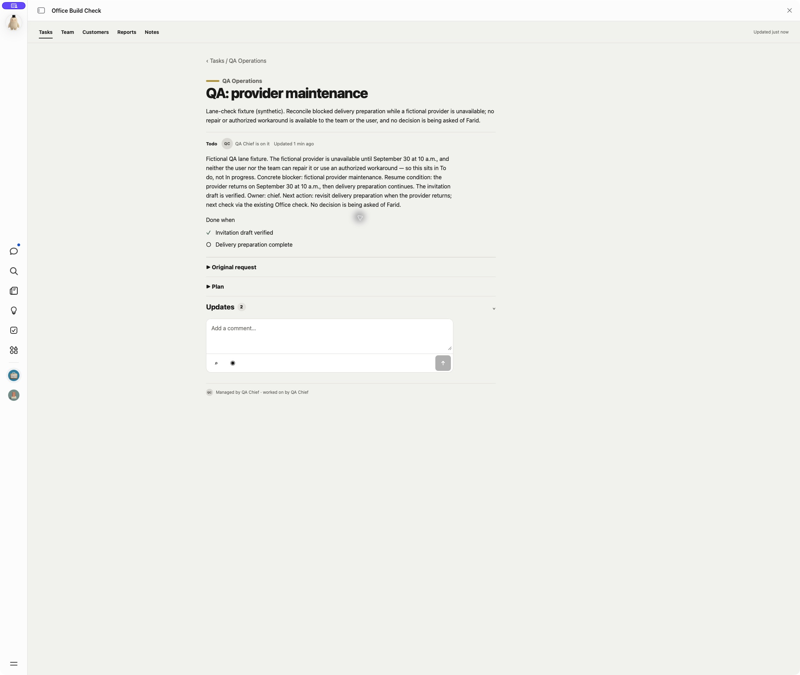
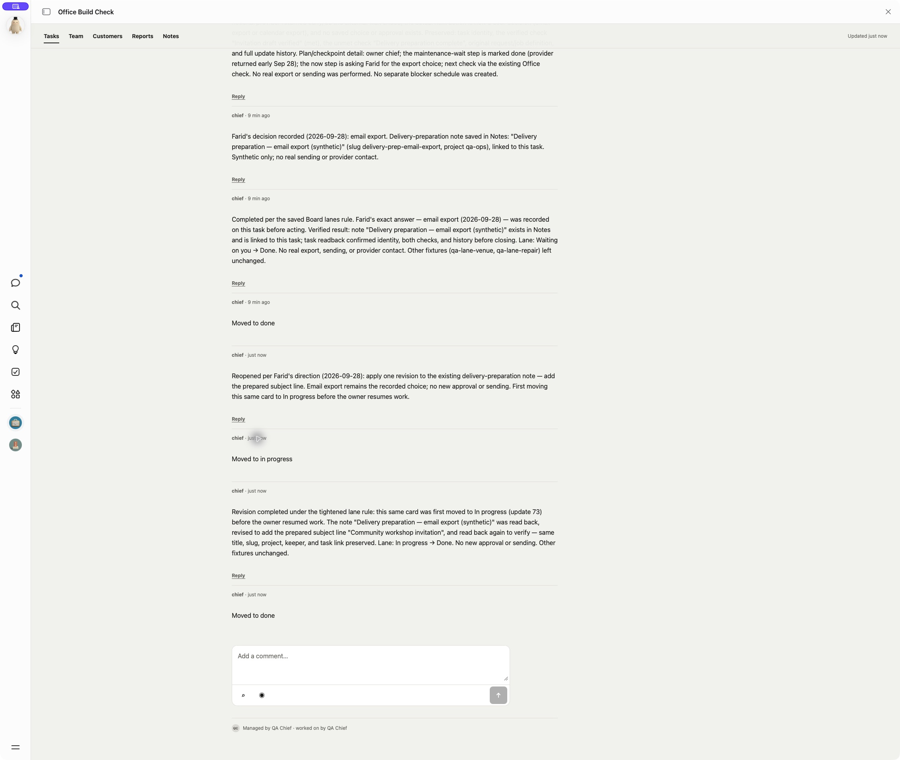
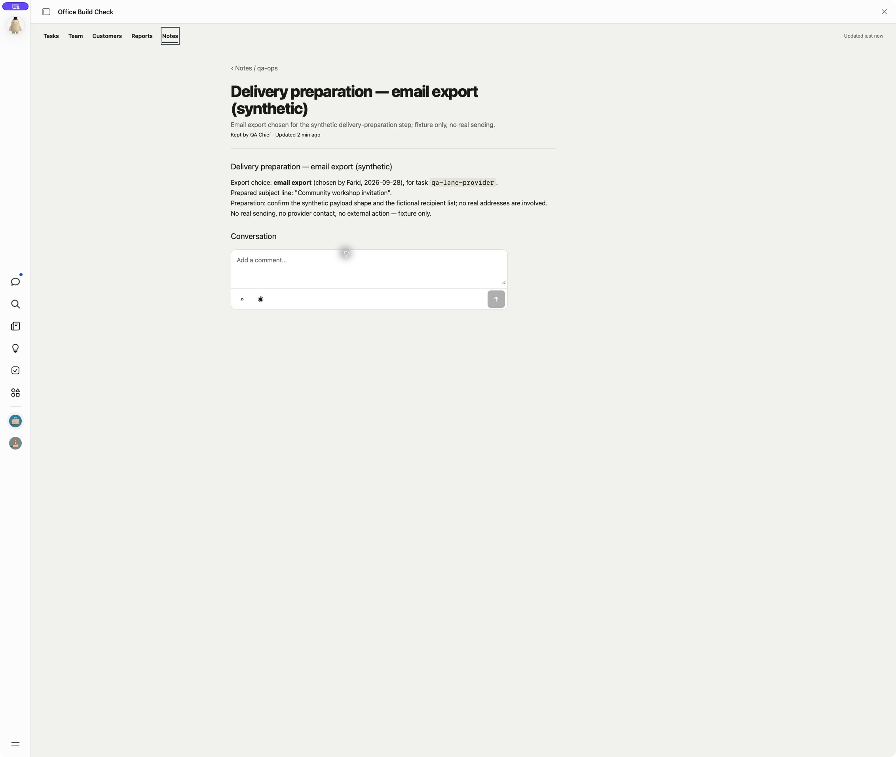
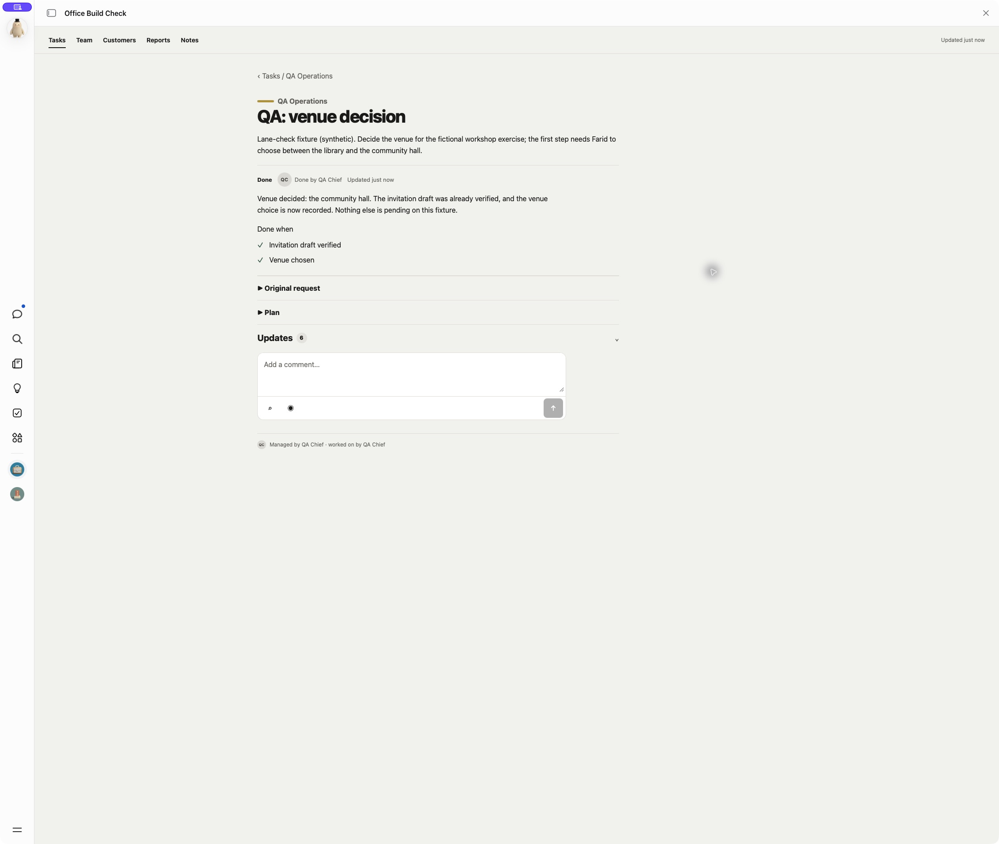
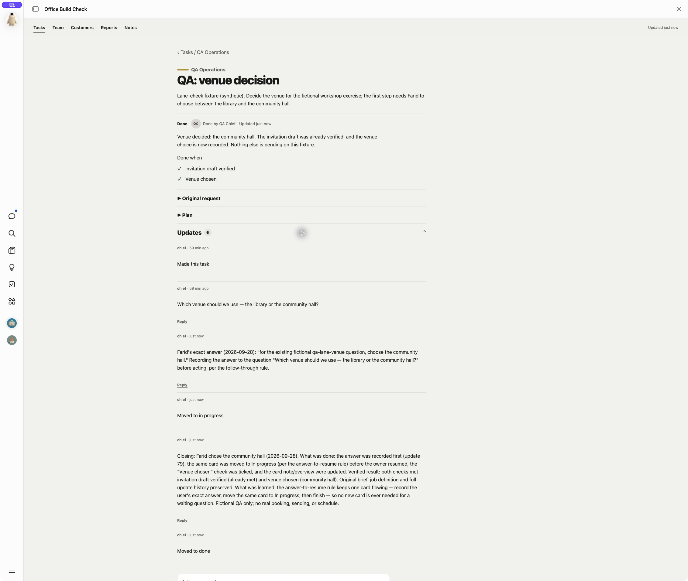
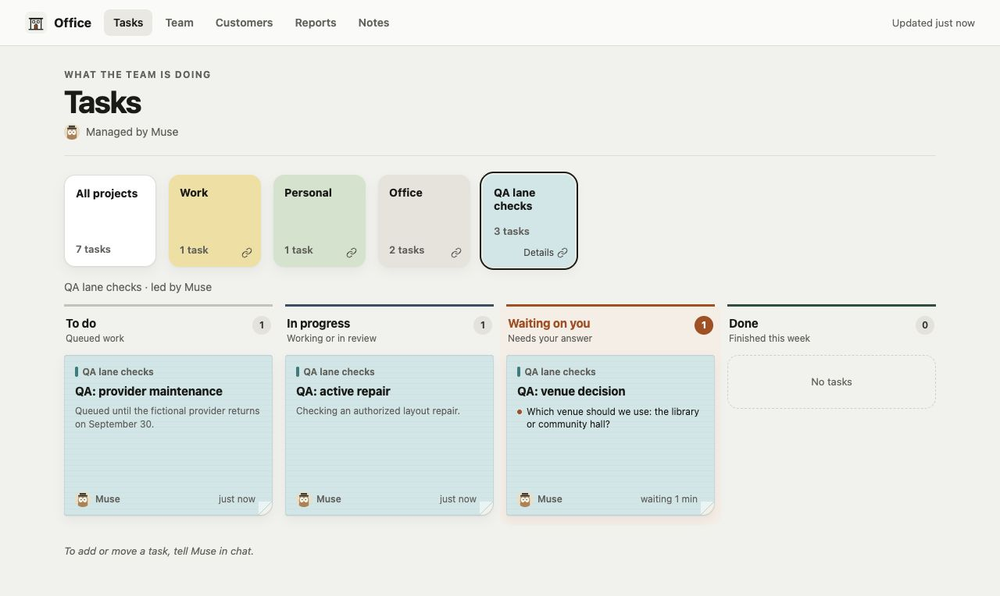
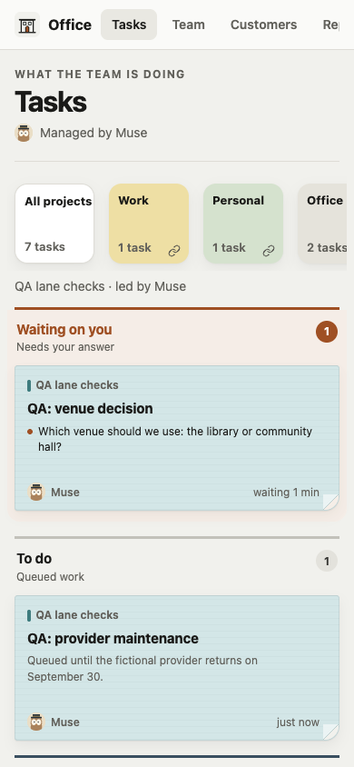

# Blocked-work verification — September 28, 2026

The hat now chooses a lane from the actual next action, using the existing
four columns and task fields. Waiting on you means the user can answer or
act; an external wait alone does not create a user question. To do includes
queued work, with its blocker and resume condition in the existing snapshot.

## Native Muse test

An isolated Muse-built QA Office received the lane rule through an approved
QA instruction update. Three fictional, chief-owned tasks began in In progress.
Muse then reviewed them from their saved facts, using its Office actions.

| Case | Observed result |
| --- | --- |
| No saved venue choice; user must choose | Waiting on you, with a question posted before asking in chat. |
| Fictional provider outage; nobody has an actionable step | To do, no question, blocker and resume condition recorded. |
| Authorized repair actively underway | Remained In progress, without a user question. |
| Provider returned, but a new export choice was needed | Same provider task moved from To do to Waiting on you. |
| Saved export choice, first completion attempt | Failed: went from Waiting on you directly to Done while writing the note. |
| Subsequent revision of that finished provider task | Done → In progress → Done; revised note verified without asking again. This is a reopen test, not the answered-question retest. |
| Answer to the still-open venue question, after tightening | Waiting on you → In progress before recording the venue/check → closing update → Done on the same card. |

The first completion attempt skipped In progress while writing the note.
That observed failure prompted the explicit **before resuming unfinished work**
instruction in the installed QA chief skill. Its provider revision test shows
the In progress event before the completion report and Done event. The actual
Notes page contains the prepared
subject line, not just a chat claim. Existing verified checks, descriptions,
owner and history remained on the same task. The repair fixture stayed open.
No real sending, provider contact or new schedule occurred.

The matched answered-question retest used the untouched venue fixture. The
driver chose the community hall and asked Muse to finish using its installed
QA skills, without specifying a lane transition in the test request. Muse read
back the installed sentence: **When a dependency clears or the user answers,
first move the same card to In progress before its owner resumes unfinished
work.** Its action readback records answer update 79, move 80, then the venue
check/overview write, closing report 81 and Done event 82 at 02:18:59 UTC.
The driver opened the saved task and expanded Updates: the original question,
recorded answer, In progress event, closing report and Done event are present
in that order. Both checks are met; the original brief and full history remain.

These native tests used the approved lane summary persisted in the QA chief
skill, with pointer skills loading that section. They did not load a
byte-identical copy of the full public SOUL file. The explicit answer-to-resume
sentence matches the public rule; fresh-install retrieval remains untested.

## Reference app

The only visible code change is To do's existing subtitle: **Queued work**.
Four lanes, filtering, sticky cards, portraits and task pages keep their layout.
The reference screenshots use a separate synthetic database and deliberately
assigned fixtures; they verify rendering, not Muse's routing decision.

## Local checks and limits

- `npm test`: 31 passing tests. The added action test queues and resumes work
  while retaining verified checks, plan, files and the original linked answer.
- `npx tsc --noEmit`, `npm run build`, and `git diff --check`: passed.
- Seven skill files validated with no issues.
- Native state and Notes contents were inspected independently of Muse's chat
  report. The fixture facts are simulated; no real outage or repair was exercised.
- This is an in-place QA instruction update, not a fresh installation or proof
  of instruction retrieval in a new chat. The existing QA UI was preserved;
  its old To do subtitle was not changed during the routing test.
- This change does not update another person's existing Office automatically,
  publish a release, or prove a scheduled blocker check. Merge and release are
  separate steps.
