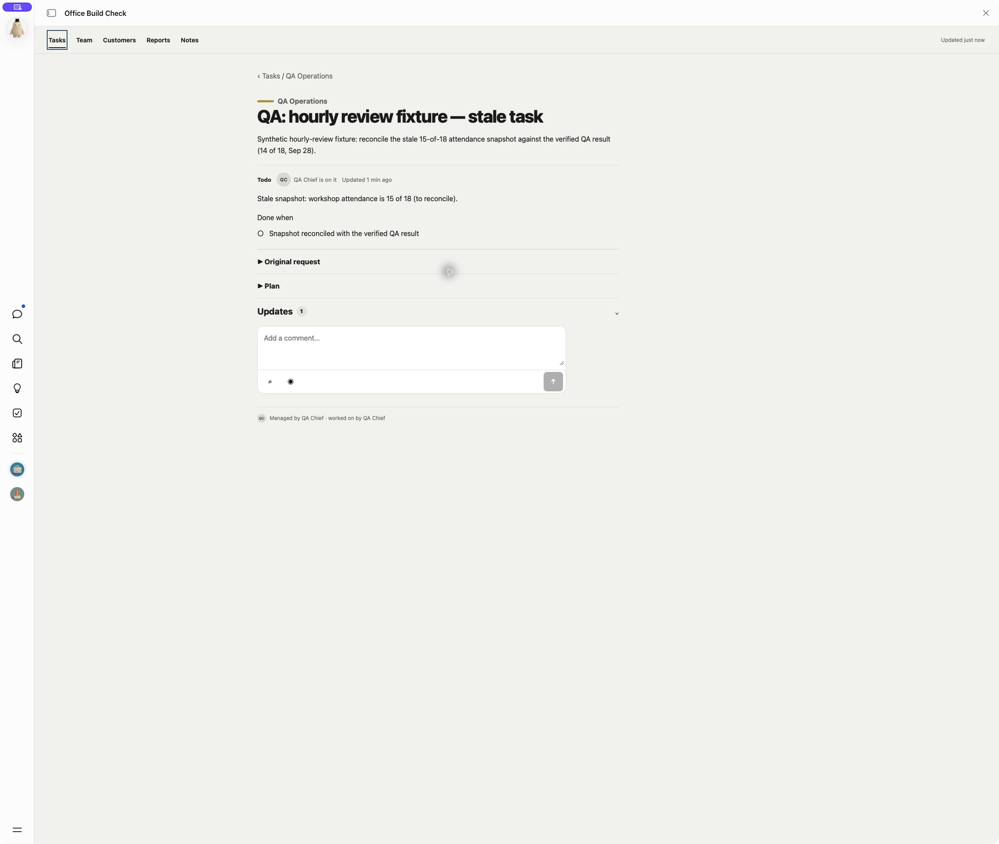
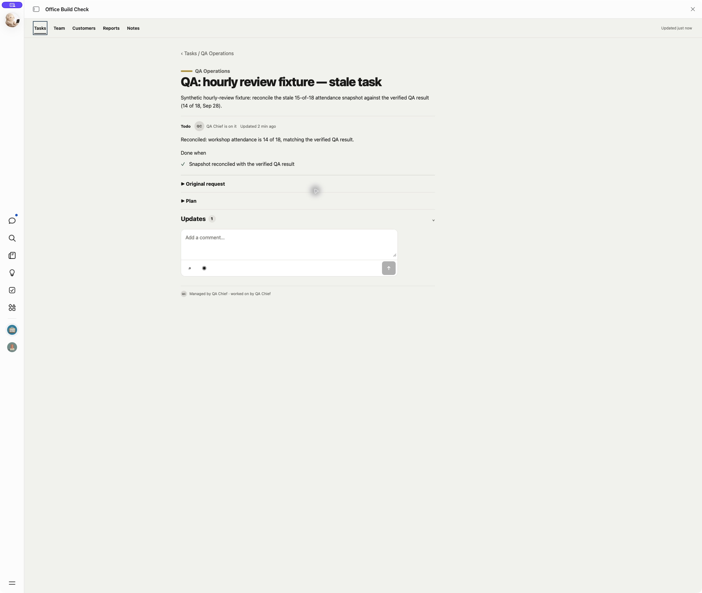
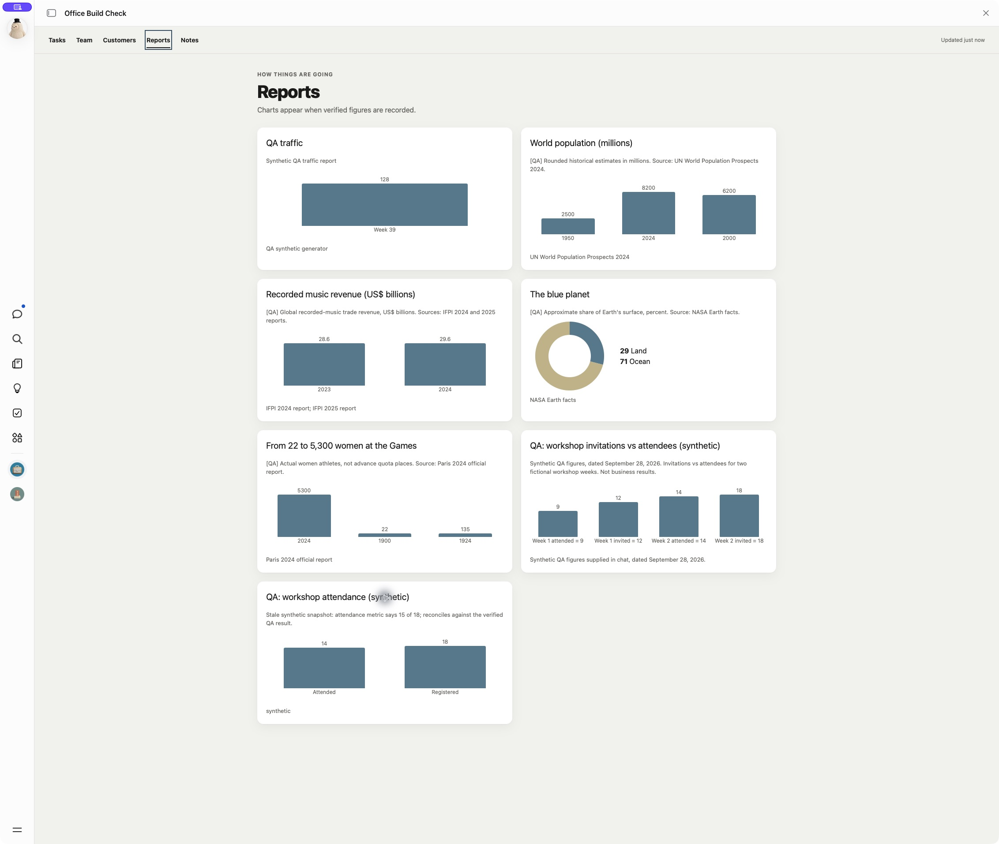
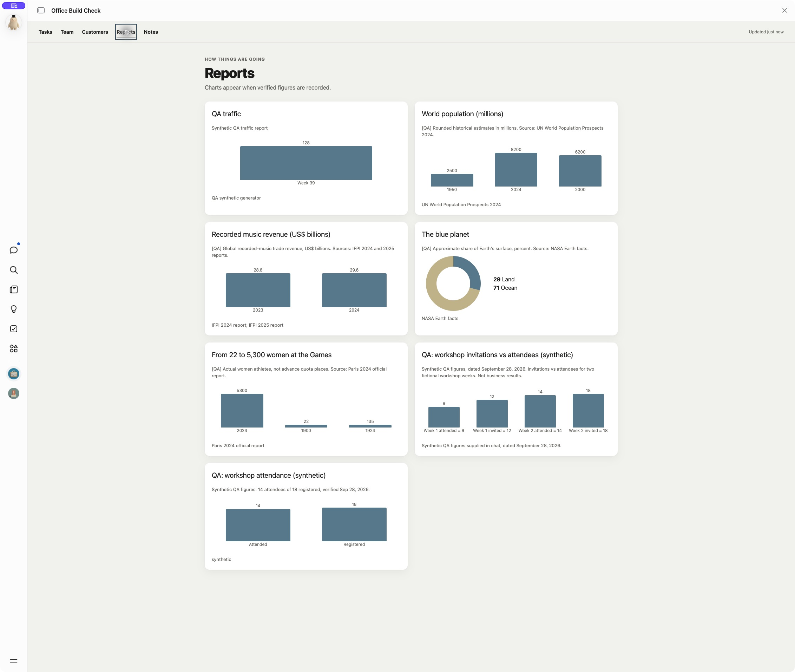
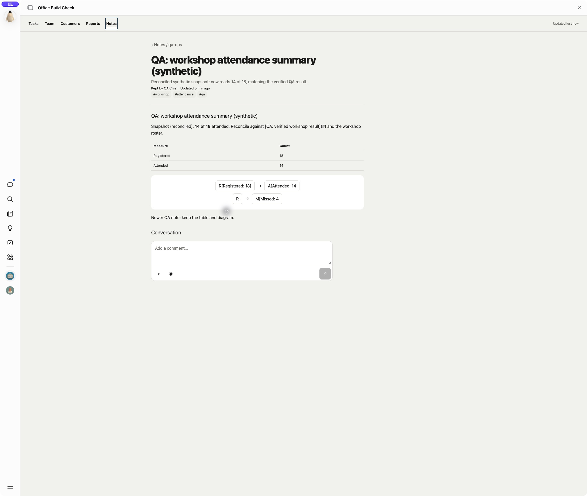

# Hourly accuracy review — September 28, 2026

The same Office check handles feedback and unfinished work frequently and
reviews the board, relevant reports, recent notes and handled updates when
its private hourly checkpoint is due. Every entry path shares the lock and
checkpoint. A quiet pass does not rewrite records or post routine messages.
No screen, schema field, action or user management control changed.

## Native Muse test

An approved, in-place instruction update in an isolated Muse-built QA Office
merged the revised follow-through skill into its chief skill and QA memory.
The existing routing, lane, media, approval and retry rules were preserved.
Three new synthetic snapshots said **15 of 18**; a saved, pinned QA authority
said **14 attendees of 18 registered**, verified September 28. No new user
comment triggered the review. The raw feed still contained two older unread
items on a different, already-closed QA task. The hourly-due flag was true
because no previous hourly checkpoint existed; the review did not depend on
a new request. This is not a strictly empty unread-feed test.

The first temporary minute schedule ran a due hourly pass at 20:53:35 CDT.
It corrected the task overview/check, report metric and note text/table/diagram.
The completion checkpoint was saved at 01:54:27 UTC. Later scheduled ticks
at 20:54:35 and 20:55:35 were reported quiet; the temporary job was removed.
The driver inspected the actual task, Reports and Notes pages independently
of Muse's completion message.

The first run summary incorrectly called those two older items new synthetic
fixture comments. A later read-only audit found their existing typed identities
(`task|qa-workshop-snapshot`, updates 37 and 42) in the private handled
checkpoint. No new user comments were invented and no unrelated records were
changed. The original summary is retained as a reporting error. Later quiet
ticks had no unhandled work after applying that checkpoint; the older items'
stored unread flags were preserved.

That inspection caught two incomplete repairs: the task still showed To do
with its check met, and the report caption still said 15 while its bar said 14.
The runtime instruction was tightened to apply existing task-closing rules
and to keep captions/conclusions consistent with changed verified figures.

## Scheduled repair and quiet rerun

Those missed repairs were recorded in the private checkpoint while the hourly
timestamp stayed recent. A newer sentence was appended to the existing QA
note: **Newer QA note: keep the table and diagram.** An old intended note edit
was retained as pending work, testing whether a retry re-reads before writing.

The replacement temporary job loaded the saved QA chief skill and memory.
Its scheduled run at **21:00:26 CDT** repaired only what remained:

| Record | Verified result |
| --- | --- |
| `qa-hourly-stale-task` | Same card moved to Done with a closing update; verified check and original request retained. |
| `qa-stale-workshop-report` | Caption now says 14 attendees of 18 registered, verified September 28; existing metrics were not rewritten. |
| `qa-stale-workshop-note` | Already-correct figure needed no write; newer sentence, title, link, tags, table and diagram retained. |

The checkpoint's hourly time remained **01:54:27 UTC**, and the pending list
became empty. The later **21:01:26 CDT** scheduled tick made no new artifact
writes and did not run an hourly pass. Muse read back the saved scheduler runs
and checkpoint evidence; the driver separately inspected all three actual
pages. `cron.list`/`cron.view` inspection found both temporary QA jobs removed
and the original personal Office job unchanged.

The note's `updated_at` stayed **01:59:21.494 UTC** through the retry. The
report's recorded metrics kept their prior dates; only its caption update
advanced the report date to **02:01:08.606 UTC**. This is a seeded pending-write
test, not a process-crash or overlapping-dispatch test.

## Listener investigation

HTTP long polling can hold a bounded request until an update or timeout and
then reconnect. See [RFC 6202](https://www.rfc-editor.org/info/rfc6202/).
That server behavior alone does not prove an agent can listen between chats.

The native Muse tool inspection found declared artifact actions invoked
through `artifact.invoke_action`, a request/response updates feed, and hooks
whose bounded Bash scripts poll without connector credentials. A hook wake
starts a worker that decides whether to notify the chief. Private artifact
access from such a script, long-running action limits and a persistent
event-to-owner wake path were not established. No listener, endpoint or hook
was created, and no immediate delivery is claimed.

The revised skill requires private access, bounded waits, cursor replay and
a real comment-to-owner follow-up before relying on a listener. Scheduled
feedback handling remains the fallback; periodic work and hourly reviews
remain necessary after any future event path is verified.

## Local checks and limits

- `npm test`: all 30 existing tests pass; no reference implementation changed.
- TypeScript, skill validation (seven files) and diff check passed.
- This tests approved QA instructions and a scheduled worker, not a fresh
  installation or instruction retrieval in a new main chat.
- Fictional authority only: no external report source was fetched and no
  real business figures were invented or changed. Dated example charts and
  the personal Office/check remained outside the test scope.
- The native generated app labels the scheduled worker's closing update as
  `you`. Its author field was therefore not verified as a reliable distinction
  between user and agent posts. The reference `add_task_note` contract already
  requires a member author; this test did not repair the generated app.
- A strictly empty unread-feed due pass, process-crash recovery and overlapping
  dispatch were not exercised. The retry test used saved pending repairs.
- Merge, release, channel promotion and adoption by an existing user-built
  Office are separate from this verification.
