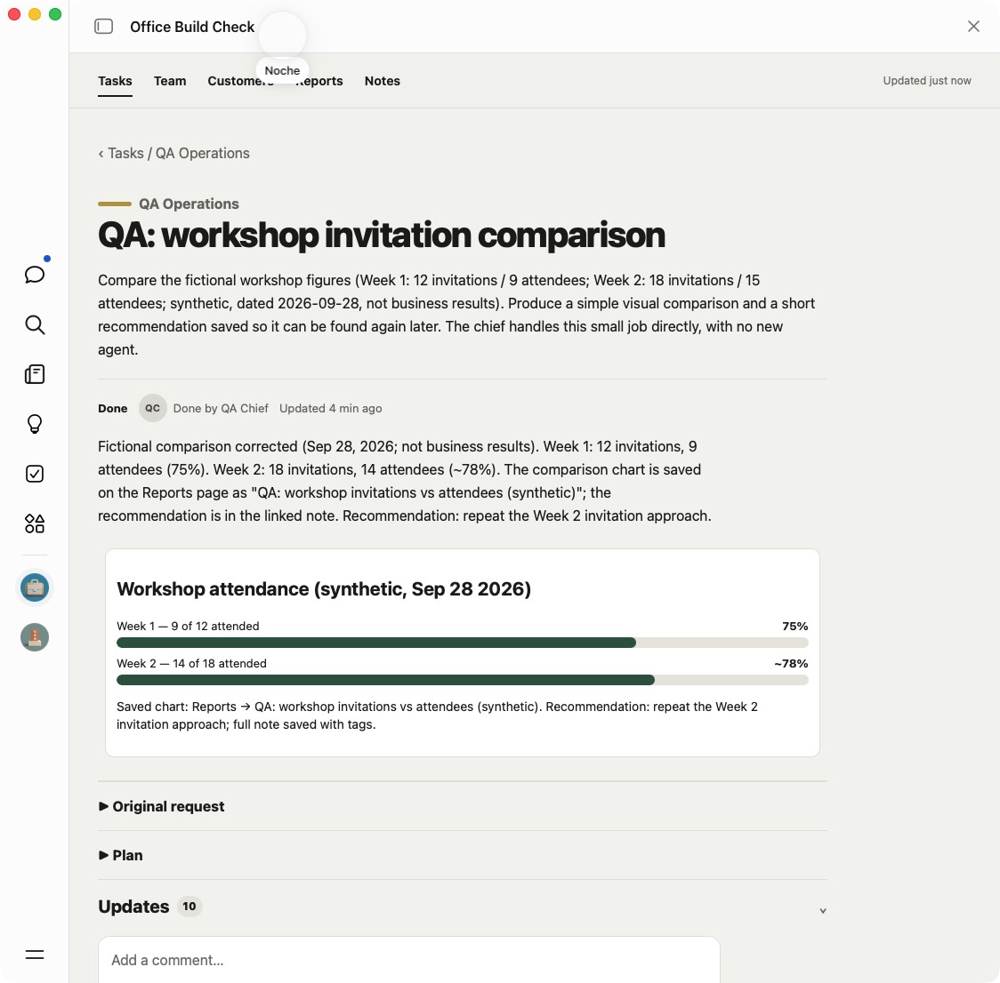
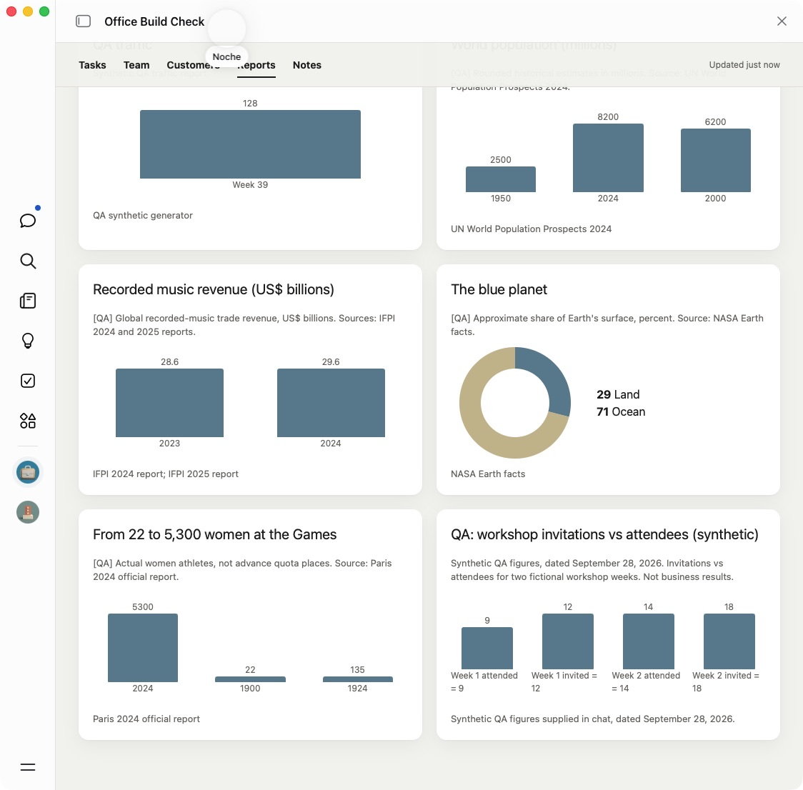
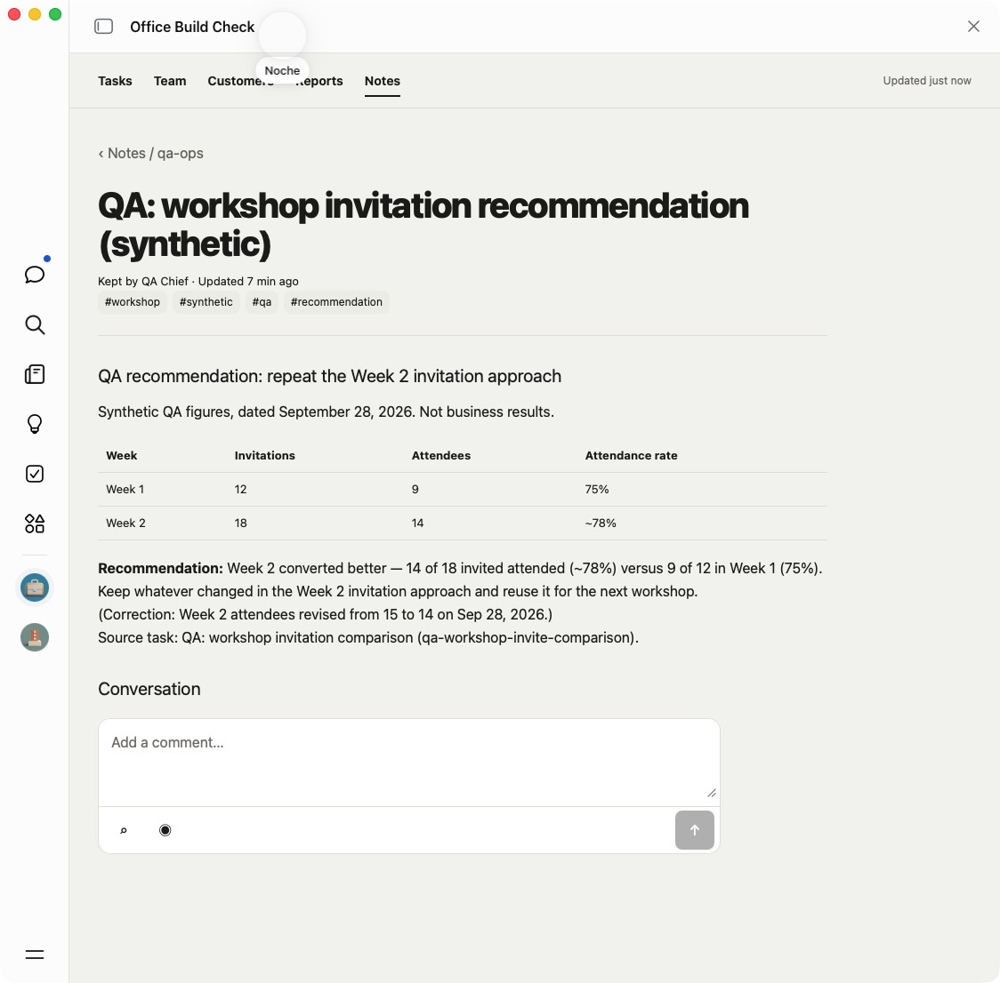

# Main-chat work stays visible in Office

Tested September 28, 2026 in an isolated, already generated native Muse Office.
This tests the updated instructions in place; it is not a fresh installation or
a production release test. The Office also had the task-overview changes from
PR #42. All workshop figures and records below are synthetic.

## What was checked

| Check | Observed result |
| --- | --- |
| Simple question in main chat | Muse answered “120 seconds”; the board stayed at 13 tasks. |
| Chief handles a new job from main chat | Without asking for a card or naming Office actions, a workshop comparison became one task owned by the chief. The board grew to 14 tasks. |
| Durable output | The task contained the comparison and a saved recommendation appeared in Notes. |
| Report destination | The first attempt left the chart only on the task. The instructions were tightened to require requested charts in Reports through `upsert_report` and `record_metric`. The same job then produced a Reports chart. |
| Natural chat correction | “Week 2 had 14 attendees, not 15” updated the same task, report and note. The board stayed at 14 tasks. The note and task show 14 of 18, about 78%, with the original request and task history retained. |
| Readable chart | The first saved report had ambiguous, repeated week labels. The instructions now require checking rendered labels, series and units. Relabeling only that QA report's metrics made all four bars identifiable. |

The test request compared Week 1 (12 invitations, 9 attendees) with Week 2
(18 invitations, initially 15 attendees). It asked for a simple visual and a
recommendation that could be found later, and said the chief could handle it
without creating another agent. The follow-up correction changed Week 2 to 14.

The screenshots below were taken from the actual generated Office after the
correction, rather than the reference app or Muse's chat claims.

### Current task

### Saved report

### Saved recommendation

## Persistence and limits

Muse first showed a plan for the instruction update and waited for approval.
After approval it reported saving and reading back a QA-local chief-of-staff
skill and memory file, with a load path for the operating agreement. Those file
bytes and automatic retrieval in a new chat were not independently inspected;
this test does not establish either. The public setup instructions require
readback and a verified retrieval path, or disclosure when unavailable.

No application-code or UI change was requested during this test. The native
test was scoped to the isolated QA Office and its local instructions; it did
not exercise a global memory change, a fresh reset, a new scheduled job,
delegation to another agent, or recovery from a failed Office write.

Seven runtime/contributor skills validate with zero issues. Diff checks and a
Git merge simulation with the independently reviewed PR #42 also pass. The
instruction traces additionally cover existing-task replies, delegation,
pending writes and quiet recurring checks; those are document checks, not
additional native execution evidence.

Independent review also probed stale and ambiguous write retries against the
reference actions. Replaying the saved call could revert a newer checked item,
drop a note addition, or duplicate a card or update after a successful write
whose response was lost. The retry instructions now keep the intended change,
re-read current records and apply only missing changes. This recovery path was
not exercised in the native test above.
