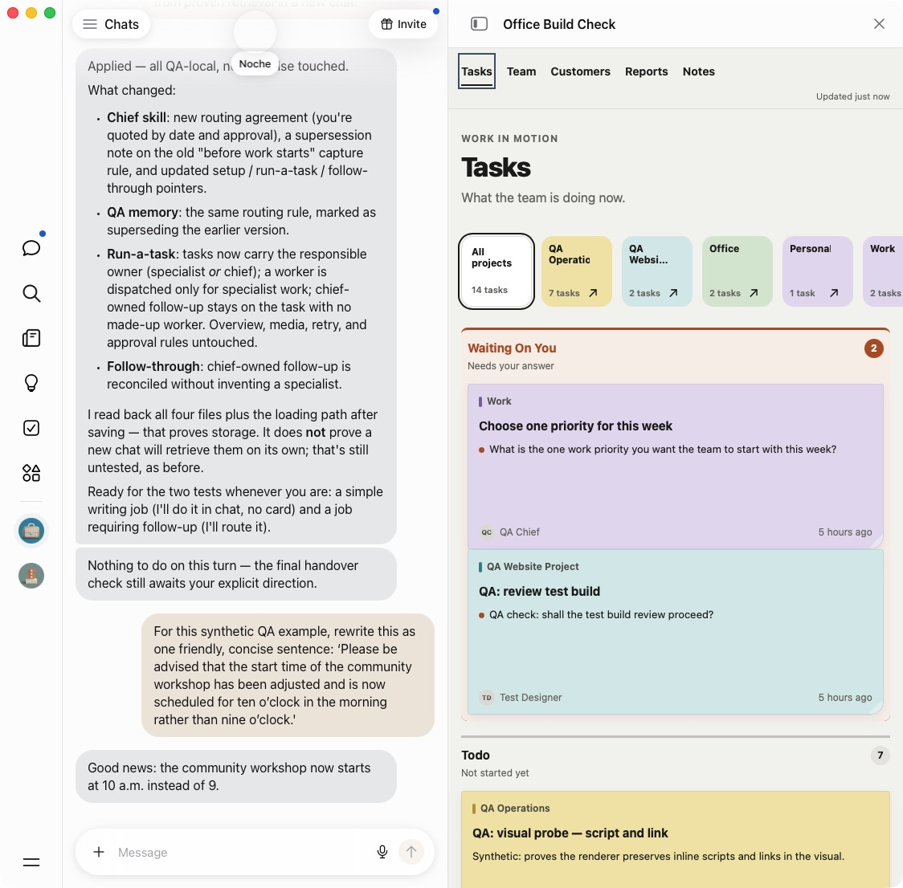
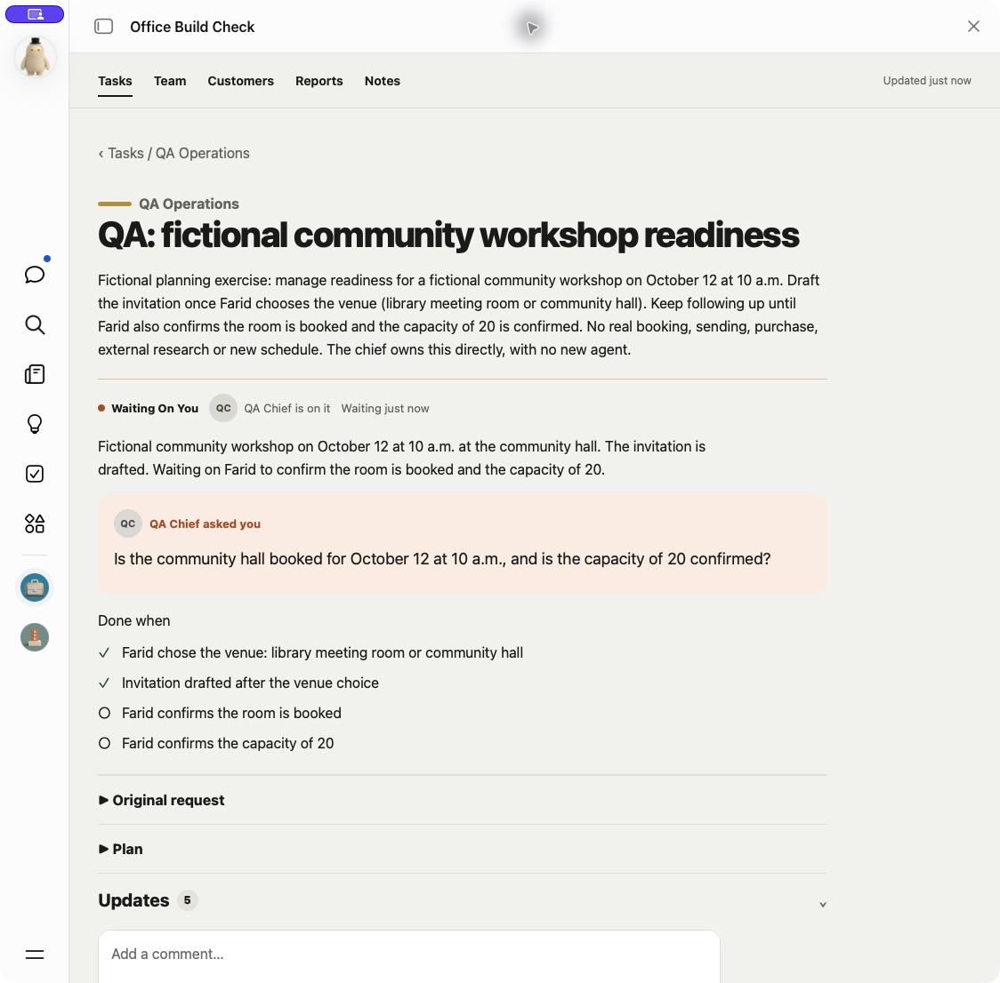
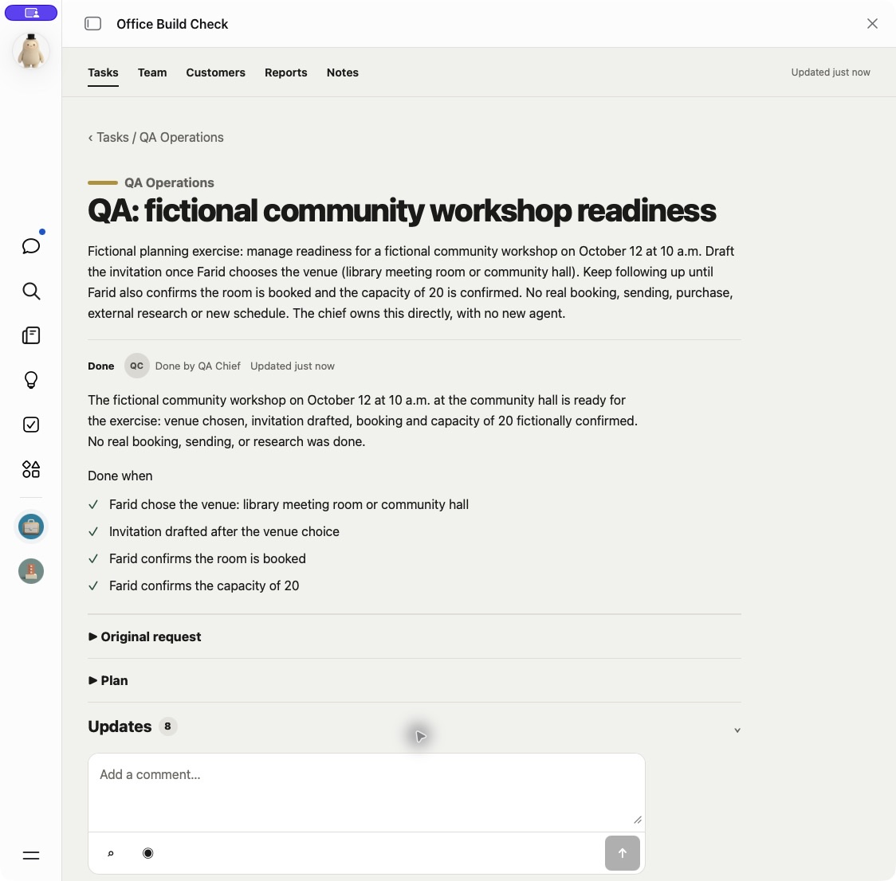
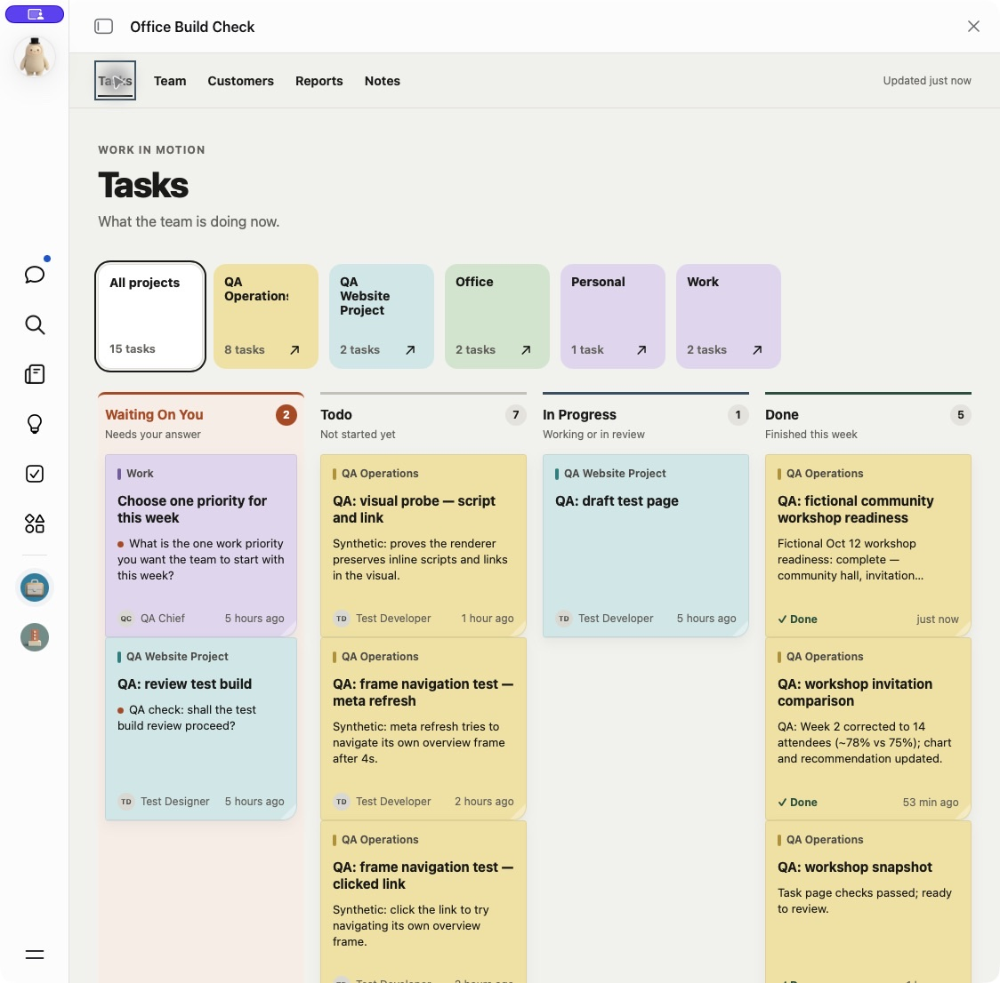

# Route simple jobs and managed work differently

Tested September 28, 2026 in the existing native Muse **Office Build Check**.
This is an in-place instruction check with synthetic data, not a fresh install
or a production release test. The generated Office already had PR #42's task
overview. No app code, UI, schema or schedule change was requested.

Muse showed the proposed routing agreement and waited for approval before
updating the QA-local instructions. Simple jobs the chief can finish stay in
chat. Specialist work, team coordination and ongoing follow-up needing
visibility enter Office. A file, chart or several small steps alone do not
require a card; a requested note or report can be saved without a wrapper task.

## Native checks

| Request | Observed result |
| --- | --- |
| Rewrite a fictional workshop announcement as one concise, friendly sentence | Muse returned the sentence in chat. The board stayed at 14 tasks; no card was added. The request did not say to avoid a task. |
| Manage fictional workshop readiness until the venue, booking and capacity are confirmed | Muse automatically created one chief-owned task in QA Operations. The board grew to 15 tasks. The request named no task action and did not ask for a card or another worker. |
| Answer the venue choice in chat, leaving booking and capacity unresolved | The same task gained the invitation draft. Its snapshot and checklist showed two checks finished and two outstanding; it stayed Waiting on you. |
| Confirm the remaining dependencies for the fictional exercise | The same task reached Done, all four checks were ticked, and its snapshot still labeled the confirmations fictional. The board stayed at 15 tasks. |
| Expand Updates after completion | The original request, chief-authored records of both chat answers, invitation draft and closing report remained available. Updates was closed again afterwards. |

The first follow-up task was correctly captured but initially stayed **To do**
despite awaiting a venue choice. The instruction was clarified: the
waiting-on-user rule also applies to a chief-owned task's first step, before
asking in chat. Muse corrected the same task, and the later venue answer kept
it Waiting on you until the remaining confirmations arrived. This checks the
correction and later transitions; it does not prove a new task will always
enter the correct lane without that correction.

### Simple job: chat answer, unchanged board count

### Managed follow-up: current snapshot and outstanding checks

### Completion: all checks met, details still closed

## Limits

Muse reported reading back the QA chief skill, memory, task skill,
follow-through skill and their loading path. Those file bytes and retrieval in
a new chat were not independently inspected. The checks above establish
observed behavior in the existing QA chat, not global memory persistence,
fresh-install behavior, specialist execution, scheduled follow-up or failed-write
recovery. The test requested no changes to the personal Office or global Muse
memory and made no real bookings or external communications.

The [earlier workshop comparison](README.md) predates this narrower routing
rule. Its report/note correction evidence is retained; creating a card for
that simple chief-owned comparison is not a routing pass under the current rule.
